# Cortex Agent 系统架构

> **文档定位**：本文是 Cortex Agent 的**系统架构总览**——用图说话，讲清楚组件构成、调用关系与数据流。
>
> 配套文档 [`architecture.md`](./architecture.md) 是**代码组织规范**（分层归属 / 反模式 / Code Review Checklist / ADR），回答「新代码该放哪、怎么写」；本文回答「系统由什么组成、怎么跑起来、一次请求怎么流转」。

---

## 0. 一句话架构

Cortex Agent 是一个**助手驱动的网络设备运维智能体平台**：前端 Vue3 SPA + 后端 Rust（Axum）单体，基于 `adk-rust` 框架，以「会话绑定助手 → 助手分发到对应 Agent → CortexAgent 运行时主循环驱动 LLM + 工具」为核心，叠加知识库 RAG、MCP、Skill、Rhai 监控插件、沙箱执行等横向能力，持久化依赖 PostgreSQL + Redis + Qdrant + 对象存储。

---

## 1. 系统全景

### 1.1 全景架构图

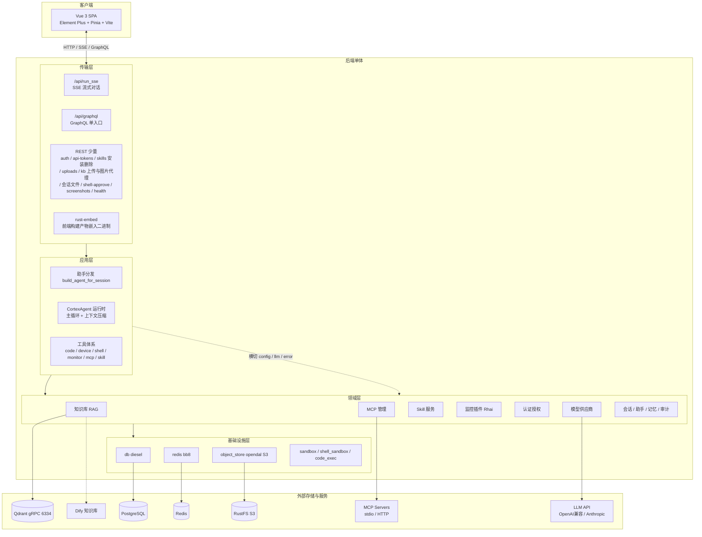

> 注：图中「领域层」为概念分组。代码侧 Skill（`src/domain/skill/`）、监控插件（`src/domain/monitor/`）、模型供应商（`src/domain/model_provider/`）是独立领域上下文目录，与 `src/domain/` 平级（分层归属以 [`architecture.md`](./architecture.md) §1 为准）。MCP Servers 中含本仓库自带的 `cortex-mcp` stdio 工具二进制（见 §7.2）。

### 1.2 技术栈一览

| 层 | 技术 |
|---|---|
| 前端 | Vue 3 · Element Plus · Pinia · Vue Router · Vite · marked + highlight.js（Markdown 渲染） |
| 后端框架 | Rust 2024 · Axum 0.8 · async-graphql（GraphQL 单入口） |
| Agent 框架 | `adk-rust`（Agent / Runner / Session / Tool / Memory / Artifact / RAG / MCP） |
| 数据访问 | diesel + diesel-async（PostgreSQL）· bb8-redis · qdrant-client · rmcp · opendal(S3) |
| 脚本引擎 | rhai（监控插件运行时） |
| 部署 | release 编译期 `rust-embed` 嵌入前端 → **主服务单文件二进制自包含部署**；workspace 另产辅助 bin：`crates/cortex-mcp`（stdio MCP 工具）、`src/bin/rhai_runner`、`src/bin/reset_llm_tables`，按需部署（见 DEPLOY.md） |

---

## 2. 启动与依赖装配

启动入口 `src/main.rs`，依赖装配集中在组合根 `src/bootstrap/mod.rs::build_app_deps`（项目**唯一**的依赖装配点，禁止进程级全局变量）。

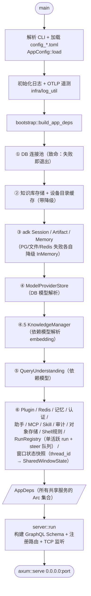

**`AppDeps` 是全局依赖容器**，通过 Axum `State` 与 GraphQL `Context` 注入到所有 handler/resolver。可降级服务以 `Option<Arc<...>>` 承载（DB 不可用时为 `None`，功能静默降级而非崩溃）。

---

## 3. 请求处理：一次流式对话的完整链路

这是系统最核心的链路：`POST /api/run_sse` → 前端实时收到 SSE 事件流。

### 3.1 链路总览

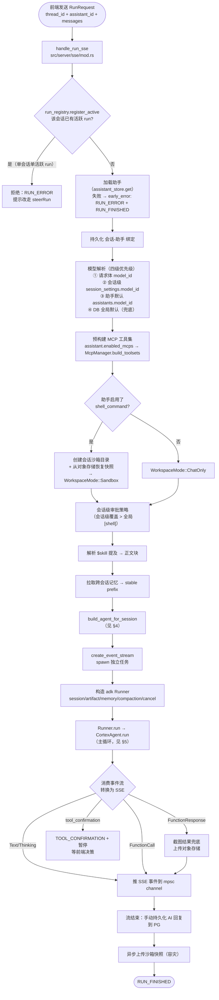

### 3.2 关键阶段说明

| 阶段 | 要点 |
|---|---|
| **模型解析** | DB 模型供应商存储是唯一数据源；四级优先级保证 UI 切模型、会话记忆、助手默认都能生效 |
| **工作区决策** | `Custom 助手 + enabled_tools 含 shell_command` → 惰性创建 `{data_dir}/sessions/{session_id}/` 沙箱目录（T1 Sandbox 档）；否则纯对话（T0 ChatOnly） |
| **会话容灾** | 沙箱目录为空（节点故障切换）时，从对象存储拉最新 `snapshot.tar.zst` 恢复；每轮 `RUN_FINISHED` 后异步上传新快照 |
| **Runner 编排** | adk-rust Runner 负责 session 持久化/回放、artifact、memory、两层 compaction、cancellation；CortexAgent 是它驱动的 `Agent` trait 实现 |
| **手动持久化** | 流结束后 SSE 层手动把 AI 文本回复 `append_event` 到 PG（补偿 adk-rust 持久化行为）；用户取消时不持久化半截回复 |
| **单活跃 run 与 steer** | 每会话同时仅允许一个活跃 run（`run_registry`，`src/infra/run_registry.rs`）：run 启动 `register_active`，重复提交被拒（提示走 steer）。运行中追加输入走 GraphQL `steerRun` → FIFO steer 队列（提交时已解析 @mention 与附件），`SteerPort` 注入 CortexAgent 主循环，在**下一次模型请求前**拼为新的 user 轮（对齐 codex `steer_input`；turn 收尾 draining 期间拒绝新 steer，前端回退正常提交）。 |
| **取消机制** | `CancellationToken` 注入 Runner + CortexAgent + ShellToolDeps，`cancelRun`（GraphQL mutation，按 thread_id）查表并 cancel，**同时清空未消费 steer 队列**（对齐 codex interrupt 的 clear_pending），工具执行 `select!` 监听 |

### 3.3 SSE 事件协议

前端按 `type` 字段分发渲染。事件定义见 `SseEventMsg`（`src/server/sse/types.rs`）：

| 事件类型 | 用途 |
|---|---|
| `RUN_STARTED` / `RUN_FINISHED` / `RUN_ERROR` | 运行生命周期（FINISHED 的 reason 区分 complete/error/tool_confirmation） |
| `TEXT_MESSAGE_START/CONTENT/END` | 流式文本分片 |
| `THINKING_MESSAGE_START/CONTENT/END` | 模型思考过程分片 |
| `TOOL_CALL_START/ARGS/END` | 工具调用（含 MCP 来源 `server_name`） |
| `TOOL_CALL_RESULT` | 工具返回结果 |
| `TOOL_CONFIRMATION` | 需用户确认的工具调用（暂停等待） |
| `SHELL_APPROVAL_REQUEST` | Shell 命令审批请求（前端弹窗 → `/api/shell-approve` 响应） |
| `CONTEXT_USAGE` | token 用量上报，**占用口径（gross，不扣 cache_read，与主循环 effective_tokens 同口径）**：字段 prompt/completion/total/child_tokens/threshold + `window_size`（窗口总量，进度条分母）/ `context_remaining_percent`（剩余百分比 0-100，前端显示「XX% context left」）/ `session_total_tokens`（会话累计高水位，计费语义）。`total_tokens` 压缩后自然回落（前端 floor 在 `CONTEXT_COMPACTED` 时清零放行）且 cap 至 `window_size`；`child_tokens` 为子 agent 并行任务花费，独立于 total。仅响应完成帧推送 + run 收尾 budget 兜底一次（覆盖不回 usage 的 provider）；run 正常结束落库 `session_settings`（**用户取消不落库**），重进会话经 `sessionHistory.token_usage` 恢复 |
| `CONTEXT_COMPACTED` | 上下文已压缩通知（含 compaction_count；累计 ≥2 次时前端提示用户新建会话） |
| `FILE_ARTIFACT` | 工具/shell 产出的文件卡片（`[[ARTIFACT:...]]` 标记 → path/filename/title/mime/size，前端走 `/api/sessions/{id}/files/{path}` 下载） |
| `CHILD_AGENT_ACTIVITY` | 子代理（spawn_agent）活动流（task_name/kind/delta/result 等，前端展示子任务进度） |

---

## 4. 助手与 Agent 分发

会话运行时统一入口 `build_agent_for_session`（`src/agent/builder.rs`）。会话绑定一个助手（内置 / 自定义），**所有助手（含内置）一律走 `build_custom_agent` 统一构建**——内置助手的配置（system_prompt / enabled_tools / max_tokens）在 seed 时写入 DB（`seed_builtin` 数据驱动），运行期与自定义助手同路径，不再有忽略 DB 配置的专用 builder。

> 历史「内置助手专用 builder」分支已移除：`device_command.rs` 已删除（设备命令助手改由 DB seed 驱动走通用路径）；`monitor_plugin.rs`（监控插件助手）已暂下线（seed 不再写入、派发不再调用，代码保留待重新启用）。

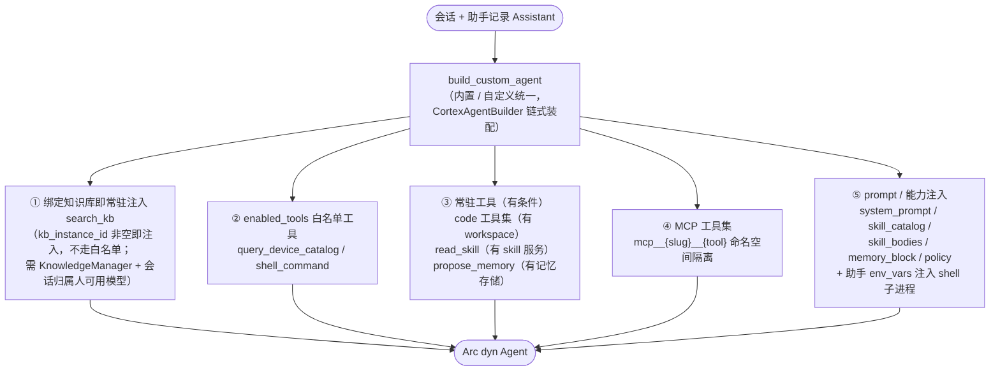

**助手模型**：`Assistant`（`src/domain/assistant/`）记录 name / description / system_prompt / model_id / enabled_tools / enabled_mcps / kb_instance_id / kind / agent_type。助手 CRUD、复制、分享、fork、导入导出均走 GraphQL。会话内可切换助手并落库（`SessionSettingsStore`——session_settings 合并大表统一承载标题/模型/思考级别/沙箱审批/助手绑定，取代旧的 4 张拆分小表）。

---

## 5. CortexAgent 运行时主循环

`CortexAgent` 是 adk `Agent` trait 的项目级实现（`src/agent/cortex/`），是所有助手的统一执行引擎。按职责拆为 17 个子模块：run（主循环，自 mod.rs 拆出）/ builder（装配）/ prompt（分层提示词）/ window（窗口状态）/ compaction（压缩）/ context_tool（get_context_remaining）/ multi_agent（spawn/wait 子代理）/ soft_landing（软闸提醒/借轮）/ thinking（思考参数）/ llm_call（LLM 调用）/ tool_exec（工具执行）/ hook（钩子）/ analytics（分析）/ trim（修剪）/ env_probe（环境探测）/ role（子代理角色）。

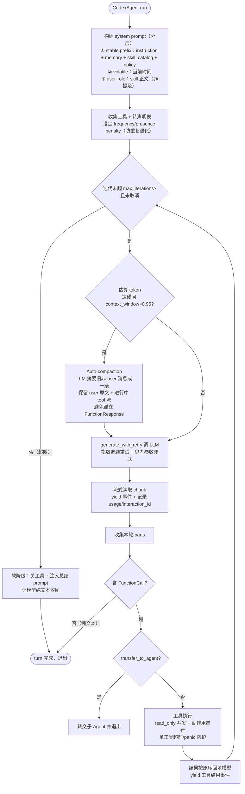

**设计要点**：

- **Prompt 分层缓存**：stable prefix 放最前保证命中前缀缓存；volatile（时间）单独一层；skill 正文以 user-role 注入（不进缓存前缀、不污染用户消息气泡）。
- **协议驱动终止**：`turn_complete` / `finish_reason` 即结束，不做流式文本重复检测（退化治理交给 thinking budget + max_iterations + 采样 penalty）。
- **思考参数兜底**：模型不支持 `thinking/effort` 时首事件返回参数错误，去参数重试一次并固化 config。
- **工具并发策略**：对齐 adk `ToolExecutionStrategy::Auto`——只读工具 `join_all` 并发，有副作用工具串行，结果按模型原序回填。
- **上下文窗口治理（对齐 codex）**：压缩仅按模型 `context_window` 阈值触发，不再按轮数/单轮 token——软闸 ×0.95 与硬闸 ×0.95 **对齐**：达 95% 即**无条件强制压缩**（无「裁完够了就跳过」的逃生门），剩余占比 ≤0.15 时提醒模型收尾；provider 报上下文超窗错误时占用钉满并转压缩。三比例为常量固化，每次压缩视为「开新窗」（窗口号单调递增，软着陆 flag 复位）；`WindowState` **跨 run 存活**——server 层按 thread_id 维护 `SharedWindowState` 经 builder 注入（`last_usage_total` 跨 run usage 种子，无种子则闸门判定退化为字符估算、压缩永不触发），`compaction_count` 为会话级累计。`[context]` 段现存配置项：`chars_per_token` / `tool_max_output_bytes` / `fallback_context_window` / `compact_model_id` / `max_spawn_depth` / `max_concurrent_children` / `multi_agent_mode`（窗口/比例相关配置已移除）。
- **多智能体（可选）**：`spawn_agent`/`wait_agent` 内建工具（仅当 `max_spawn_depth > 0` 时注册）让模型派生子代理跑独立子任务；`ChildAgentFactory` + 并发限流器（`max_spawn_depth`/`max_concurrent_children` 默认 3）控制扇出，子代理活动通过 `CHILD_AGENT_ACTIVITY` SSE 事件实时回流前端。
- **token 用量持久化**：每轮 run 结束把会话级累计用量落库 `session_settings`（`set_token_usage`，total=0 不落），重进会话经 `sessionHistory.token_usage` 恢复，对齐 codex 会话级 token_info。

---

## 6. 工具体系

### 6.1 工具分类总览

```mermaid
flowchart LR
    subgraph 内置助手（DB seed 驱动，走通用路径）
        T_DEV["device_command（设备命令助手）<br/>query_device_catalog<br/>（search_kb 改为绑定 kb_instance_id<br/>即常驻注入，不走白名单；<br/>lookup_device_id / snmp_test_collect<br/>随监控插件助手下线，代码保留）"]
        T_MON["monitor_plugin 助手已暂下线<br/>（validate_monitor_plugin 等<br/>工具不再注入）"]
    end
    subgraph 自定义助手白名单
        T_WL["query_device_catalog<br/>shell_command"]
    end
    subgraph 常驻工具 按条件注册
        T_CODE["code 沙箱代码工具<br/>read_file / glob /<br/>grep / edit_file / create_file"]
        T_SKILLR["read_skill<br/>按需拉取 skill 正文"]
        T_MEM["propose_memory<br/>提议跨会话记忆"]
        T_CTX["get_context_remaining<br/>查询上下文剩余（始终开启）"]
        T_MULTI["多智能体六工具（max_spawn_depth>0）<br/>spawn_agent / send_message /<br/>followup_task / wait_agent /<br/>interrupt_agent / list_agents"]
        T_SHOT["screenshot<br/>截图落对象存储"]
    end
    subgraph 外部工具集
        T_MCP["MCP 工具集<br/>mcp__slug__tool"]
    end
    subgraph 工具输出治理
        T_TRUNC["truncating<br/>单工具输出字节上限"]
        T_FILTER["filter<br/>语义压缩（表格/MD/grep）"]
        T_REDACT["redact<br/>敏感信息脱敏"]
    end
    T_MCP --> T_TRUNC
    T_TRUNC --> T_FILTER
```

### 6.2 工具输出治理

所有工具集经 `wrap_toolset_with_truncation` 包装：先按工具家族做**语义结构化压缩**（`filter/`：表格抽核心行、Markdown 抽 TOC、grep 收敛命中行），再**硬截断**到 `context.tool_max_output_bytes`。截图类大输出走对象存储外链，不占上下文。

### 6.3 Shell 命令安全模型

`shell_command` 工具（`src/tools/shell_command/`）的执行受三层约束：

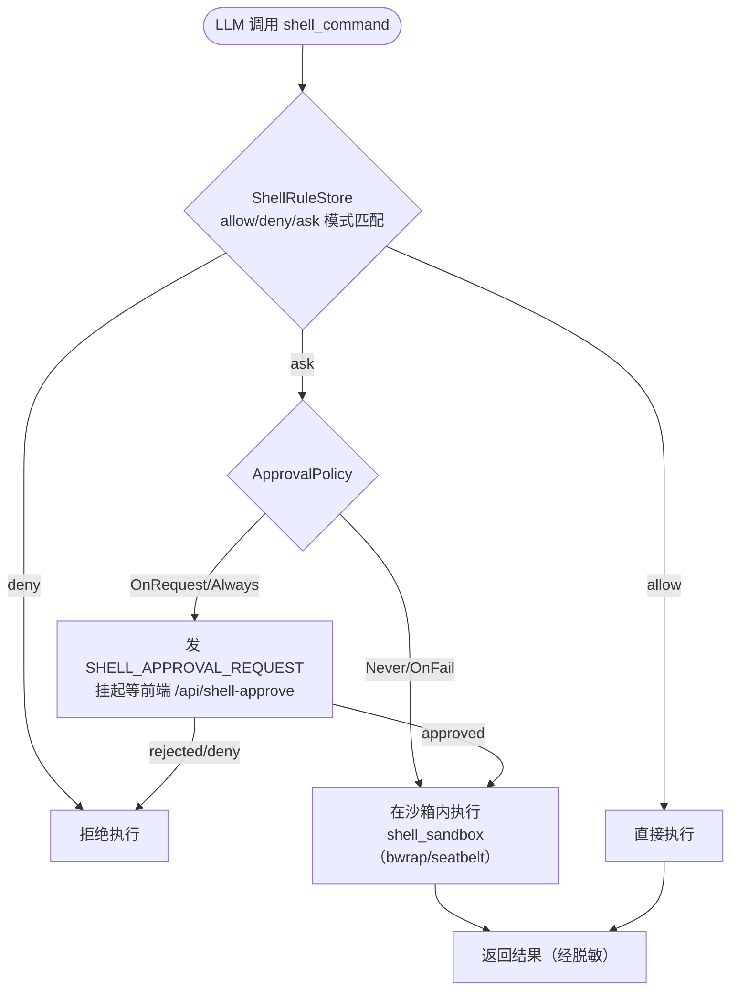

- **`SandboxMode`**（ReadOnly 只读 / WorkspaceWrite 读写 / DangerFullAccess）：控制沙箱内工作区写权限，`.git` 始终只读。
- **网络开关**：`policy.network_access` 控制沙箱网络访问。
- **会话级覆盖**：`session_settings`（合并大表）存沙箱模式 + 审批策略，覆盖全局 `[shell]` 配置；网络开关始终跟全局。
- **shell 环境快照**（`infra/shell_snapshot.rs`）：会话内首次执行 shell 时抓取进程环境（PATH 等）与活跃 venv，后续命令复用同一快照——保证「先 `source venv/bin/activate` 再跑 python」等会话内环境一致性，免模型每轮重复设置。

---

## 7. 横向能力子系统

### 7.1 知识库 RAG（`src/domain/knowledge/`）

**多 provider 路由**：`KnowledgeManager` 按 `kb_instance_id` 路由到不同后端，provider 实例缓存在 `DashMap`，配置变更时 `invalidate`。

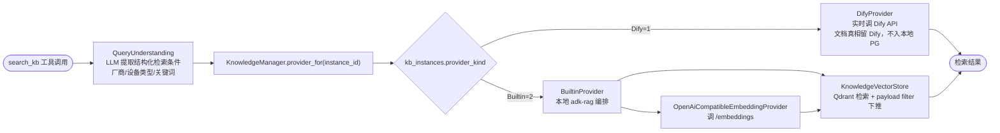

**三表关系**：`kb_instances`（实例配置，secret 字段 AES 加密）→ `kb_documents`（仅 Builtin，文档元数据）→ `kb_chunks`（分段预览，级联删除）。删 Builtin 实例时显式 drop Qdrant collection（PG CASCADE 删不了向量）。

**FAQ 学习闭环**：完整对话 → LLM 提取 FAQ 候选 → 与已有重名比对 → 前端审查 → 写回知识库。

### 7.2 MCP 集成（`src/domain/mcp/`）

`McpManager` 管理外部 MCP Server 的连接池 + 健康探测 + 工具暴露。

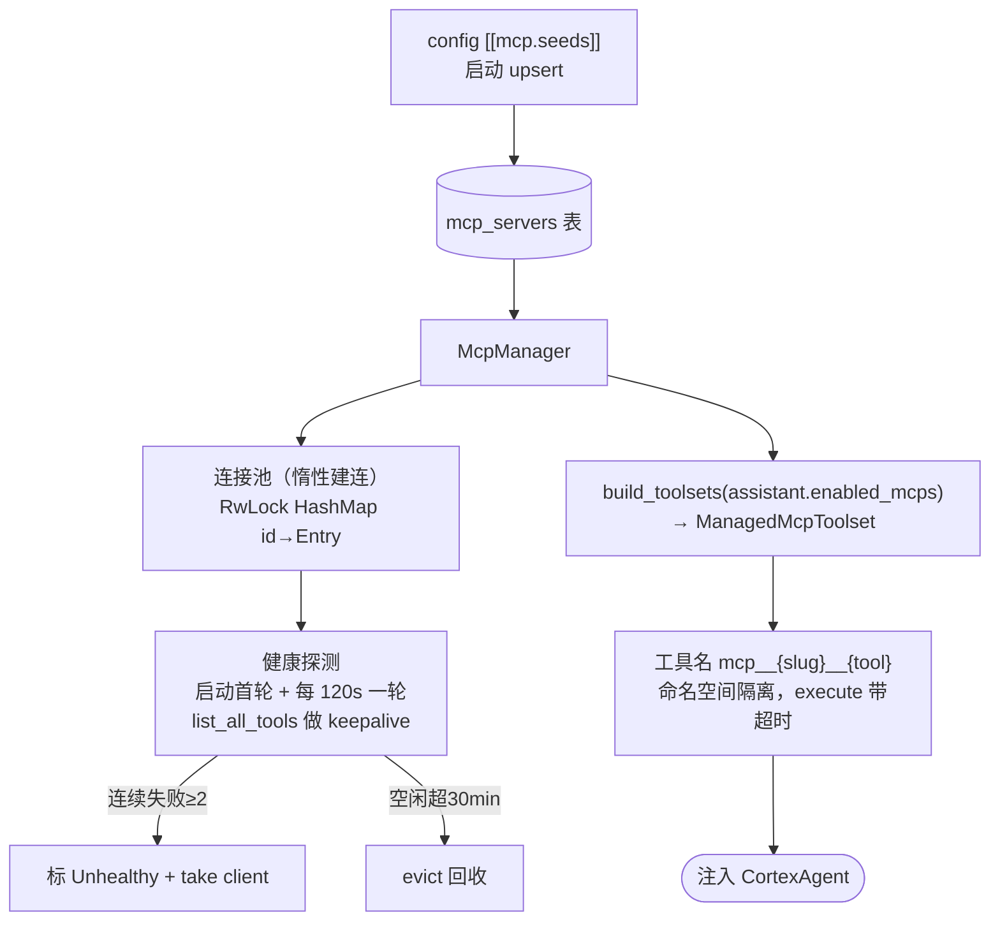

- **两种 transport**：`Stdio`（`TokioChildProcess`，逐 arg 传递防注入）/ `StreamableHttp`（远程 HTTP，支持自定义头）。连接超时 30s。
- **探测与执行互不阻塞**：探测用 `try_lock`，拿不到（工具正占连接）就跳过本次不累计失败——避免误断开有状态 MCP（如 excel 工作簿）。
- **自带 stdio 工具二进制 `cortex-mcp`**：cargo workspace 成员 `crates/cortex-mcp`（独立 bin），9 个静态注册工具——`send_email`、`db_query`/`db_schema`/`db_sample`/`db_explain`（PostgreSQL/MySQL/nyetdb，只读）、`influx_query`/`influx_schema`（v2/v3，只读）、`prom_query`/`prom_schema`（PromQL 只读）。凭环境变量配置，未配置的工具调用时返回英文「not configured」。作为普通 Stdio MCP Server 注册即可被平台调用，详见 [`cortex-mcp.md`](./cortex-mcp.md)。

### 7.3 Skill 系统（`src/domain/skill/`，Codex 风格）

文件系统 Skill，**渐进式披露**（progressive disclosure）控制 token 消耗：

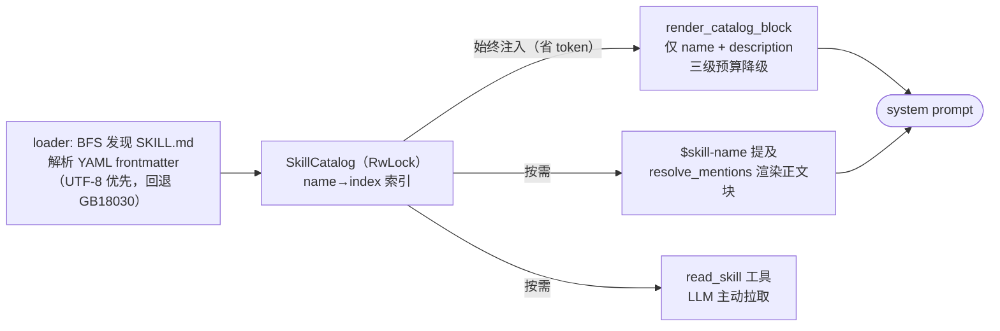

- **两类 scope**：`Builtin`（编译期 `include_dir!` 嵌入，启动解压到 `.builtin/`，版本标记控制全量重写）/ `User`（手动放 `skills/`，覆盖同名 Builtin）。
- **内置 skill**：当前仅 `skill-creator`。
- **热重载**：catalog 用 `RwLock` 保护，GraphQL `reloadSkills` mutation 重扫磁盘，新会话即时生效无需重启。

### 7.4 监控插件（`src/domain/monitor/`，Rhai 引擎）

用 Rhai 脚本定义设备监控指标采集与解析逻辑，数据契约与 `nm-plugin-api` 对齐。

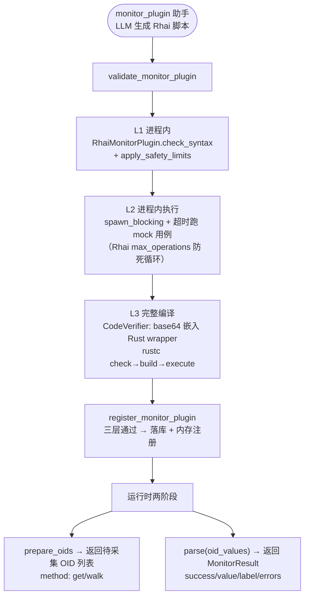

- **安全限制**（L1/L2 共用防漂移）：表达式深度 64、调用层级 50、操作数 1000、字符串 1M、数组/map 10K。
- **L2 已改进程内**：原 adk-sandbox 子进程隔离（`rhai-runner`）在 Windows 上有 stdin 句柄泄漏（首次执行后永久阻塞触发 10s 超时），改为进程内 `spawn_blocking` + 超时执行——Rhai 引擎自带 `max_operations` 防死循环，崩溃风险由引擎限制兜住。`rhai-runner` bin 与 `SandboxVerifier` 保留但当前无生产调用方（见 §7.5）。
- **助手状态**：monitor_plugin 内置助手已暂下线（seed 不写入、派发不调用，§4），但工具链（`validate_monitor_plugin` / `register_monitor_plugin` 等）与 `PluginManager` 代码保留，重新启用只需恢复 seed。
- **host_fns**：`parse_json/to_json/get_num/get_num_str/log_*`，用 `OptFloat/OptStr` 包装类型把 `Option` 带回脚本侧。
- **版本管理**：`monitor_plugins`（主表）+ `monitor_plugin_versions`（版本历史），回滚仅切 `active_version` 指针。

### 7.5 沙箱、对象存储与会话容灾（`src/infra/`）

三种「沙箱」职责不同，勿混淆：

| 模块 | 用途 | 机制 |
|---|---|---|
| `sandbox.rs`（SandboxVerifier） | Rhai 脚本子进程验证（**历史路径**） | adk-sandbox `ProcessBackend` 跑 `rhai-runner` 子进程；L2 已改进程内（§7.4），当前无生产调用方，保留备用 |
| `shell_sandbox.rs`（execute_sandboxed） | **Shell 命令 OS 级强制沙箱** | Linux bubblewrap / macOS seatbelt（宿主根只读 bind、网络/PID 隔离）；Windows 不编译，降级策略层 |
| `code_exec.rs`（CodeVerifier） | **Rhai 脚本 L3 验证 / 未来 Rust 插件** | adk-code `RustExecutor` 完整 check→build→execute |

**对象存储 `ObjectStore`**（opendal S3，兼容 RustFS/MinIO/AWS）：`put/get/delete/list/presign_get`。共享 key 规范：`screenshots/{sid}/{file}`、`uploads/{user}/{file}`、`artifacts/{app}/{user}/{session}/{file}/v{ver}`、`workspaces/{sid}/snapshot.tar.zst`。

**会话容灾 `workspace_snapshot`**：会话亲和下沙箱留本地 SSD；节点故障切换时新节点从对象存储拉快照恢复。关键保护——本地目录为空时**跳过上传**（避免空状态覆盖远端有效快照）；解包防 tar slipping（拒绝绝对路径/`..`/symlink）。

### 7.6 模型供应商（`src/domain/model_provider/`）

LLM 配置**不在配置文件**，统一由 DB「模型供应商」管理。

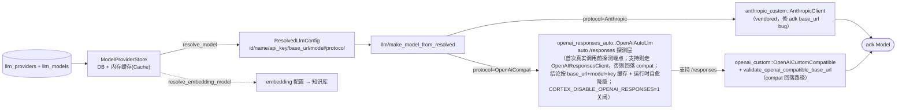

- **auto /responses 探测**（`openai_responses_auto`）：OpenAiCompat 协议在首次真实调用前发最小探测请求判断端点是否支持 OpenAI Responses API（`/responses`）——支持则优先走 adk `OpenAIResponsesClient`（结构化 FC、原生 reasoning summary），否则回落本地 compat 客户端。探测结论按 `base_url|model|SHA-256(api_key)` 缓存（确定性结论长期有效，瞬时故障写 60s 短 TTL 负缓存）；运行时自愈——responses 路径遇 401/403/404/405/501 或 parse 错误即降级 compat 重发。环境变量 `CORTEX_DISABLE_OPENAI_RESPONSES=1` 一键关闭（构造期读取，纯 compat）。

- **缓存**：`refresh_cache` 重载时解密每个 API Key（内存明文供运行时用，不外泄）；`resolve_model` 命中缓存，指定模型禁用时回退默认 → 任意启用模型（避免历史会话报错）。
- **加密**：`AesCodec` AES-256-GCM，密文 `base64(nonce‖ciphertext+tag)`；密钥内置源码（`security::APP_SECRETS`，多密钥支持轮换）；DB 另存 `key_suffix`（末 4 位掩码）。同一套 codec 供 model_provider / mcp / auth 复用。
- **探测 `probe`**：按能力标签分流（chat > embedding > rerank），30s 超时，HTTP 状态码映射可操作错误文案；用 `resolve_for_probe` 绕过启用缓存以测禁用模型。
- **anthropic_custom 为何 vendored**：adk-model 1.0.0 的 `AnthropicClient::new` 忽略 `base_url`，导致中转地址失效；字段 `pub(super)` 无公开 setter，项目层无法修复，故本地拷贝一份只改这一处。

### 7.7 认证与授权（`src/domain/auth/`）

`AuthService` 编排全部认证流程，始终启用（无开关，DB 不可用时降级 `None`）。

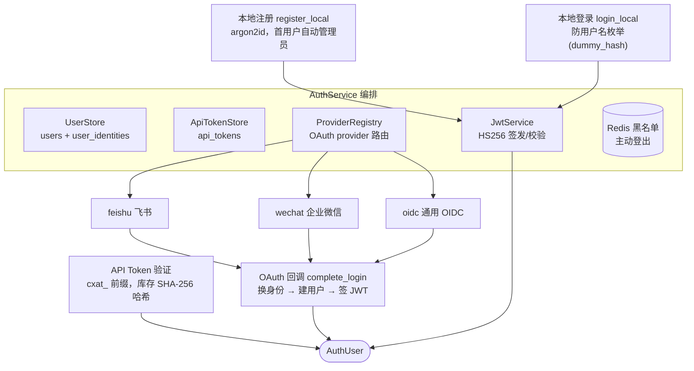

- **容错**：单个 SSO provider 配置错误只跳过并 warn，不中断整个认证服务；`client_secret` 支持 `enc:` 前缀走 AesCodec 解密。
- **JWT 校验**：Redis 黑名单查询带 2s 超时 fail-open（Redis 不可达时降级放行，不阻断请求）。
- **API Token**：明文 `cxat_<base64url>`，库内只存 `SHA-256(明文)`（不可逆），所有失败统一错误（防探测）。
- **两种认证入口**：账号登录（Cookie JWT，Web UI）/ API Token（`Authorization: Bearer`，程序化访问，受限——仅允许删除会话）。

---

## 8. 数据存储与外部依赖矩阵

| 存储/服务 | 用途 | 不可用时降级 |
|---|---|---|
| **PostgreSQL** | adk Session（多轮对话）、Artifact、知识库（kb_instances/documents/chunks）、设备目录 catalog、模型供应商、会话级配置（session_settings：模型/助手/思考级别/沙箱审批合并大表）、跨会话记忆 + 建议、认证（users/user_identities/api_tokens）、自定义助手、MCP servers、监控插件、Shell 规则、审计日志 | Session/Artifact/Memory → InMemory；其余 `Option=None` 静默关闭对应功能；**连接失败=致命退出** |
| **Redis** | adk Memory（Agent 长期记忆）、JWT 黑名单（主动登出）、SNMP 采集工具 | Memory → InMemory；黑名单 fail-open 放行；SNMP 工具不可用 |
| **Qdrant**（gRPC :6334） | Builtin 知识库向量检索（每实例一 collection `kb_<id>`） | Builtin 知识库检索失败；Dify 类型不受影响 |
| **RustFS / S3** | 截图、上传图片、artifact、沙箱快照（容灾） | 对应功能不可用（截图/上传/容灾恢复） |
| **LLM API** | 对话生成、查询理解、上下文压缩、FAQ 抽取、监控脚本生成 | 无降级——任务无法执行 |
| **Dify** | Dify 类型知识库检索 | Dify 知识库检索失败 |
| **MCP Servers** | 外部工具能力（stdio / HTTP） | 单个 server 标 Unhealthy，工具跳过 |

### 敏感数据存储规范

- API Key / client_secret / MCP env & headers：AES-256-GCM 加密入库，前端只展示掩码（`key_suffix` 末 4 位 / `*_mask`）。
- 密码：argon2id 哈希（不存明文）。
- API Token：库内存 SHA-256 哈希（不可逆）。

---

## 9. 组件清单

| 组件 | 位置 | 职责 |
|---|---|---|
| `AppDeps` | `src/bootstrap/` | 全局依赖容器，装配所有共享服务 |
| Axum Router | `src/server/mod.rs` | 路由注册 + GraphQL Schema 注入 + TCP 监听 |
| `graphql_handler` | `src/server/mod.rs` | GraphQL 单入口 + 写操作审计 |
| `handle_run_sse` | `src/server/sse/mod.rs` | SSE 流式对话主入口 |
| `build_agent_for_session` | `src/agent/builder.rs` | 会话级助手 → Agent 分发器（内置/自定义统一 `build_custom_agent`） |
| `CortexAgent` | `src/agent/cortex/` | Agent 运行时主循环（prompt 分层/压缩/工具执行） |
| `RunRegistry` / `SteerPort` | `src/infra/run_registry.rs` | 会话单活跃 run 登记 + FIFO steer 队列（steerRun 入队、主循环下轮模型请求前消费；cancelRun 清队） |
| 工具集 | `src/tools/` | code / device_command / monitor_plugin / shell_command / filter / truncating / redact / skill_read（工具名 `read_skill`）/ propose_memory / screenshot |
| `KnowledgeManager` | `src/domain/knowledge/` | 多 provider 知识库路由 |
| `McpManager` | `src/domain/mcp/` | MCP 连接池 + 健康探测 + 工具暴露 |
| `SkillService` | `src/domain/skill/` | 文件系统 Skill 渐进式披露 |
| `PluginManager` | `src/domain/monitor/` | Rhai 监控插件管理 + 执行 |
| `ModelProviderStore` | `src/domain/model_provider/` | DB 模型管理 + 解析 + 探测 |
| `make_model*` | `src/llm/` | 模型配置 → adk Model 工厂 |
| `AuthService` | `src/domain/auth/` | 认证授权编排 |
| `ObjectStore` | `src/infra/object_store.rs` | S3/RustFS 对象存储封装 |
| `DbPool` / `SharedRedisPool` | `src/infra/db.rs` / `redis.rs` | 连接池 |
| `execute_sandboxed` | `src/infra/shell_sandbox.rs` | Shell 命令 OS 级沙箱 |
| `workspace_snapshot` | `src/infra/workspace_snapshot.rs` | 沙箱会话容灾 |

---

## 10. 目录结构速查

```
src/
├── main.rs                  # 启动入口（薄壳：--sandbox-exec-inner 拦截 + 转调 server_main）
├── lib.rs                   # 模块导出
├── error.rs                 # 统一错误类型
├── permissions.rs           # SandboxMode / ApprovalPolicy（根级共享内核）
├── bootstrap/               # 组合根：AppDeps 装配（mod.rs）+ init.rs 初始化辅助
├── config/                  # 配置定义（mod.rs 只留 AppConfig + load；
│                            #   infra/agent/auth/workspace/mcp/storage 按节拆文件）
├── security/                # 横切：APP_SECRETS + crypto.rs（AesCodec）+ reencrypt.rs
├── prompts/                 # 横切：codex 模板资产（templates/）
├── llm/                     # 横切：协议客户端 + factory.rs（模型工厂）
│   ├── anthropic_custom/  openai_custom/  openai_responses_auto/
├── server/                  # ① 传输层（Axum 路由 / GraphQL / SSE / auth）
│   ├── mod.rs               #   瘦身入口：run() + 路由表 + 静态资源（<450 行）
│   ├── graphql/             #   GraphQL 单入口（resolver 注册表）
│   ├── sse/                 #   流式对话（8 子模块；压缩已由 CortexAgent 接管）
│   ├── assistant/           #   助手 resolver（mod.rs 读+DTO / write.rs 全部写操作）
│   ├── upload.rs files.rs dify_proxy.rs shell_approve.rs audit.rs skill_install.rs
│   └── auth.rs api_token.rs session.rs mcp.rs memory.rs monitor.rs …（各资源 handler）
├── agent/                   # ② 应用层（Agent 构建 + 编排）
│   ├── builder.rs           #   助手统一分发器 build_agent_for_session（内置/自定义同路径）
│   ├── workspace.rs         #   WorkspaceMode 沙箱编排
│   ├── assistant_generator.rs query_understanding.rs
│   └── cortex/              #   CortexAgent 运行时（mod 拆 run.rs + tests.rs）
│       ├── run.rs           #     Agent trait 主循环（~1060 行）
│       └── multi_agent/     #     多智能体 V2（六工具 + AgentTree/Mailbox/Factory）
├── tools/                   # ② 工具体系
│   ├── code/                #   Codex 风格代码工具（grep.rs 测试体外 grep_tests.rs）
│   ├── filter/ monitor_plugin/
│   ├── shell_command/       #   mod + safety + approval（审批注册表）+ events（事件
│   │                        #     sink trait，斩断 tools→server）+ exec（执行管道）
│   │                        #     + tests
│   ├── device_command.rs propose_memory.rs skill_read.rs screenshot.rs
│   │                        #   send_user_message_async.rs
│   ├── registry.rs truncating.rs redact.rs
├── domain/                  # ③ 领域层（业务模型 + 领域服务 + Repository）
│   ├── knowledge/ mcp/ auth/ session/ assistant/ memory/ device_catalog/
│   ├── model_provider/ monitor/ skill/    # 领域上下文（自顶层迁入）
│   ├── audit.rs             #   AuditStore（请求侧助手在 server/audit.rs）
│   ├── shell_rules.rs
│   └── （mcp/manager/ = mod + toolset；mcp/store/ = mod + helpers）
└── infra/                   # ④ 基础设施层
    ├── db.rs redis.rs object_store.rs log_util.rs store_base.rs
    ├── run_registry.rs screenshot_cleanup.rs
    └── sandbox/             #   沙箱家族（shell_sandbox/sandbox_exec/shell_snapshot/
                             #     workspace_snapshot/code_exec）

crates/cortex-mcp/          # workspace 成员：stdio MCP 工具二进制（9 工具，见 §7.2）

> 本节为快速速查；模块分层归属与职责的权威清单见 [`architecture.md`](./architecture.md) §2。

> **分层依赖铁律**：`server → agent/tools → domain → infra` 单向；横切（config / error / llm）可被任意层引用，但不得反向依赖业务层。详见 [`architecture.md`](./architecture.md) §1。
